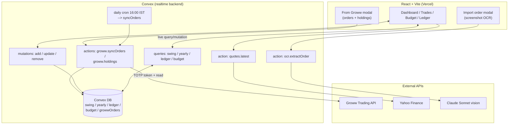
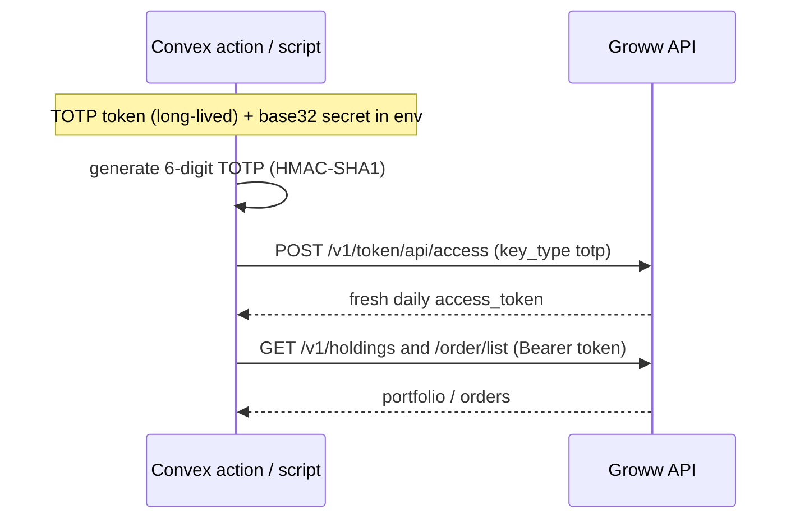
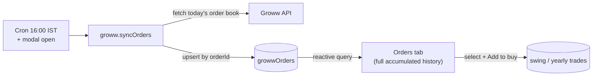
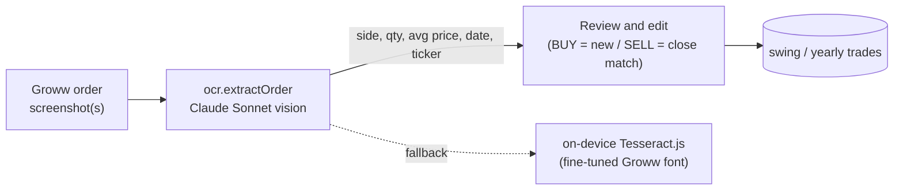

<div align="center">


# Vance

**A personal finance & trading command center** — budgets, swing/long-term stock journals, a live [Groww](https://groww.in) brokerage integration, AI screenshot import, and a six-account ledger, all synced in real time.

[](https://finance-record-iota.vercel.app)


</div>

---

## Table of Contents

- [Overview](#overview)
- [Features](#features)
- [Architecture](#architecture)
- [Groww brokerage integration](#groww-brokerage-integration)
- [AI screenshot import (OCR)](#ai-screenshot-import-ocr)
- [Data model](#data-model)
- [Project structure](#project-structure)
- [Local setup](#local-setup)
- [Deployment](#deployment)
- [Scripts](#scripts)
- [Security](#security)

---

## Overview

Vance replaces a finance spreadsheet with a live web app. It tracks a monthly **budget**, **swing-trading** and **yearly stock** journals (marked-to-market against live prices), and a six-account double-entry **ledger** — with two zero-typing ways to get trades in: a **live Groww API** integration and **AI-powered screenshot import**.

| | |
|---|---|
| **Live** | https://finance-record-iota.vercel.app |
| **Frontend** | React 19 + Vite + Tailwind, phone-optimized |
| **Backend** | Convex (realtime DB, queries, mutations, actions, cron) |
| **Brokerage** | Groww Trading API (portfolio, orders) |
| **AI** | Claude Sonnet vision (order screenshot extraction) |

---

## Features

| Area | What it does |
|---|---|
| 📊 **Dashboard** | At-a-glance budget, trading, and ledger overview |
| 📈 **Swing trading** | Short-term trade journal with days-held, net %, feedback notes |
| 🗓️ **Yearly stock** | Long-term holdings journal |
| 💹 **Live prices** | One-click mark-to-market via Yahoo Finance quotes |
| 🏦 **From Groww** | Pull live holdings & order history from your Groww account — select & add as trades, no typing |
| 🤖 **AI import** | Drop Groww order screenshots → Claude Sonnet vision extracts side/qty/price/date |
| 💰 **Budget** | Monthly allocation preview across buckets |
| 📒 **Ledger** | Six independent double-entry accounts with running balances |
| 📱 **Mobile-first** | Bottom-nav phone layout; champagne-on-black theme |
| ⚡ **Realtime** | Convex live sync across devices |

---

## Architecture



---

## Groww brokerage integration

Vance talks to the **Groww Trading API** to pull your real portfolio and order history — so trades flow in without manual entry or screenshots.

### Daily token, generated programmatically

Groww access tokens **expire every day at 06:00 IST**. Vance regenerates them automatically from long-lived TOTP credentials (no browser, no manual 6-digit code), so the integration keeps working unattended.



### What works

| Capability | Status | Notes |
|---|---|---|
| Holdings (DEMAT) | ✅ | symbol, qty, avg price |
| Positions | ✅ | open positions |
| Margins / funds | ✅ | available cash |
| Order book (read) | ✅ | **current trading day only** — Groww has no historical-orders API |
| Order placement | ⚠️ | requires a **whitelisted static IP** (SEBI rule); run from a static-IP host |
| Live quotes (LTP/OHLC) | ⚠️ | requires Groww's paid **Live Data** add-on |

### Persisted order history

Because Groww's order book is **day-scoped**, Vance snapshots it on every sync (on modal open + a daily cron) into a `growwOrders` table, deduped by order ID — building up a full history the API itself doesn't retain.



> Order **placement** scripts (`scripts/groww-buy.mjs`) are included but require a whitelisted static IP. Reads (holdings/orders) and token generation work from anywhere.

---

## AI screenshot import (OCR)

For brokers/screens the API can't cover, drop **order screenshots** and Claude Sonnet vision extracts the structured order.



The repo also ships a fine-tuned Tesseract model (`grw.traineddata`) trained on the Groww font as an offline fallback.

---

## Data model

Convex tables ([`convex/schema.ts`](convex/schema.ts)) — monetary inputs are stored raw; P/L, allocations, and balances are derived on the client to mirror the original spreadsheet formulas.

| Table | Purpose |
|---|---|
| `budget` | Monthly budget inputs; buckets auto-allocated |
| `swing` | Short-term trade journal |
| `yearly` | Long-term holdings journal |
| `ledger` | Six double-entry accounts (Gym/Needs/Wants/FD/Saving/Stock) |
| `growwOrders` | Snapshotted Groww order history (deduped by `growwOrderId`) |

---

## Project structure

```text
.
├── src/
│   ├── components/        Dashboard, Trades, Budget, Ledger, UploadOrder, GrowwOrders, ui, icons
│   └── lib/               calc, parseGroww, ocr, format
├── convex/
│   ├── schema.ts          DB schema
│   ├── swing.ts / yearly.ts / budget.ts / ledger.ts   queries + mutations
│   ├── groww.ts           Groww token gen + holdings + syncOrders (action)
│   ├── growwStore.ts      saved-orders query + upsert mutation
│   ├── ocr.ts             Claude Sonnet vision order extraction
│   ├── quotes.ts          Yahoo Finance live prices
│   └── crons.ts           daily order-sync cron
├── scripts/
│   ├── groww-token.mjs    generate daily access token (TOTP / approval)
│   ├── groww-buy.mjs      place a real order (needs whitelisted static IP)
│   └── groww-test-order.mjs   safe non-filling order smoke test
└── ocr-training/          Tesseract fine-tuning workspace (gitignored artifacts)
```

---

## Local setup

```bash
npm install
cp .env.example .env.local      # then set VITE_CONVEX_URL
npm run dev
```

For Groww/OCR features, set the backend secrets on your Convex deployment (see below).

---

## Deployment

Frontend deploys to **Vercel** (`finance-record`); backend runs on **Convex**.

```bash
npx convex deploy          # push functions + schema to Convex prod
```

**Convex environment variables** (set on the deployment, not in `.env.local`):

```bash
npx convex env set ANTHROPIC_API_KEY  sk-ant-...                 # OCR
npx convex env set GROWW_TOTP_TOKEN    <long-lived TOTP token>   # Groww
npx convex env set GROWW_TOTP_SECRET   <base32 TOTP secret>
```

The daily cron in [`convex/crons.ts`](convex/crons.ts) syncs Groww orders at 16:00 IST (after market close) and needs the Groww secrets set on the deployment.

---

## Scripts

| Command | Purpose |
|---|---|
| `npm run dev` | Vite dev server |
| `npm run build` | Type-check + production build |
| `npm run lint` | ESLint |
| `npm run preview` | Preview the production build |
| `node scripts/groww-token.mjs` | Generate a fresh Groww access token (auto-selects TOTP/approval flow) |

---

## Security

- **No secrets in the repo.** All credentials live in `.env.local` (gitignored) or Convex deployment env vars.
- Groww and Anthropic calls run **server-side** in Convex actions — keys never reach the browser.
- Groww access tokens are short-lived (daily) and regenerated from TOTP credentials.
- This README intentionally uses **diagrams, not screenshots**, to avoid publishing real portfolio data.
